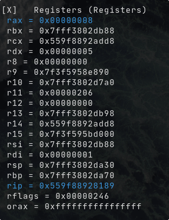
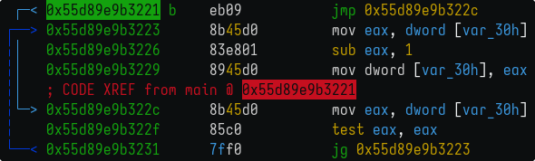

## Стан регістрів на кожному пункті

1. Массив елементів та дії віднімання та ділення на них


За цей пункт відповідає код на C:
```c
int arr[] = { 5, 3, 8, 1 };
int res1 = arr[0] - arr[2];
int res2 = arr[1] / arr[3];
```
Йому відповідає така діляка дизассембльованого коду


Як елементи масиву дебагер показує локальні змінні `var_30h`, `var_2ch`, `var_28h`, `var_24h`, що відповідають елементам 0, 1, 2 та 3 массиву. 

Також ми бачимо:

- запис (адреси `67`, `6e`, `75`, `7c`) захардкожених даних у елементи масиву 

- процес віднімання та запису результату виконання опкоду `sub` з регістру `edx` у область змінної `var_38h` по адресам `83`, `86`, `89`, `8b`. Для віднімання викорстовуються регістри `edx` (data register) та `eax` (primary accumulator).

- за ділення відповідають команди за адресами `8e`, `91`, `94`, `95`. `idiv` записує результат у регістри `eax` та `edx`

Значення у регістрах:
- на момент запису нульового та другого елементів у `edx` та `eax` перед відніманням
та після операції віднімання результат у регістрі `rdx`

  { width=50% }
  { width=50% }

- запис даних у регістри `eax` та `ecx` для ділення, після ділення

{ width=50% }
{ width=50% }


2. Блок `if`
```c
if (arr[1] == 42) {
  arr[1] = 24;
}
```
Йому відповідає


Де записується значення першого елементу масиву у регістр `eax` та далі порівнюємо
це значення із значенням `0x2a` (42). Якщо ж два значення не рівні, то виконуємо
перехід на адресу `0x5622b6d2d1a9`, інакше записуємо у перший елемент масиву `0x18` (24).

{ width=25% }
{ width=25% }
{ width=25% }
{ width=25% }


3. `switch`
```c
switch (arr[0]) {
  case 1:
    arr[0]++;
    break;
  case 2:
    arr[1]--;
    break;
  case 4:
    arr[3]--;
  case 5:
    arr[2]++;
    break;
}
```

Значення у регістрах:

{ width=16% }
{ width=16% }
{ width=16% }
{ width=16% }
{ width=16% }
{ width=16% }

Та дизассембльований код


---


4. Global variable

Вивід значення змінної (виклик `printf`)


Значення глобальної змінної знаходиться за адресою `0x556ccd28f020`


5. Цикл `while`
```c
// 5. while cycle
while (arr[0] > 0) {
  arr[0]--;
}
```


Перевіряється умова циклу

{ width=25% }
{ width=25% }
{ width=25% }
{ width=25% }

Перейшли у тіло циклу

{ width=25% }
{ width=25% }
{ width=25% }

Та знову перейшли на область перевірки умови

{ width=25% }


6. Реалізована функція `is_even`, що перевіряє `int` число на подільність
на 2.

Її виклик в `main`


Значення регістрів при виклику

{ width=25% }
{ width=25% }
{ width=25% }

Функція `is_even`


Та значення регістрів при її виконанні

{ width=18% }
{ width=18% }
{ width=18% }
{ width=18% }
{ width=18% }
{ width=18% }
{ width=18% }
{ width=18% }
{ width=18% }

7. Список зі значеннями
```c
// 7. array with specific elements
int arr2[] = { 12, 13, 14, 15, 16 };
```


## Дерево програми (функція main)


## Лістинг програми на C

```c
#include <stdio.h>

// 4. global variable
int global_variable = 28374;

// 6. own function
int is_even(int num) {
  return num % 2 == 0;
}

int main() {
  // 1. array elements and actions (division, substraction)
  int arr[] = { 5, 3, 8, 1 };
  int res1 = arr[0] - arr[2]; int res2 = arr[1] / arr[3];

  // 2. if statement
  if (arr[1] == 42) {
    arr[1] = 24;
  }

  // 3. switch on 4 cases
  switch (arr[0]) {
    case 1:
      arr[0]++;
      break;
    case 2:
      arr[1]--;
      break;
    case 4:
      arr[3]--;
    case 5:
      arr[2]++;
      break;
  }

  // 4. print global variable
  printf("%d\n", global_variable);

  // 5. while cycle
  while (arr[0] > 0) {
    arr[0]--;
  }

  // 6. function call
  is_even(arr[3]);

  // 7. array with specific elements
  int arr2[] = { 12, 13, 14, 15, 16 };

  return 0;
}
```
